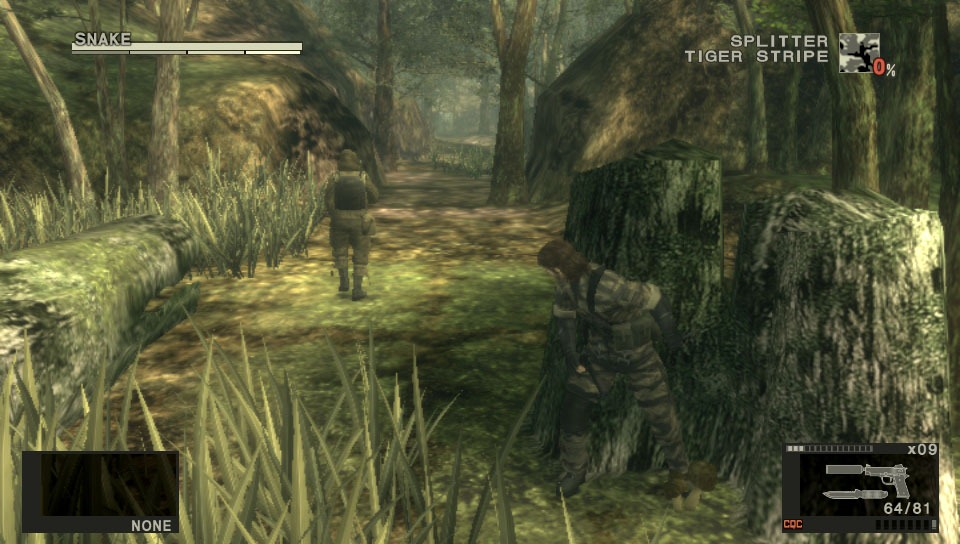
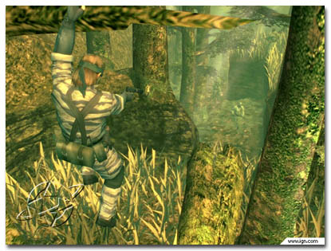
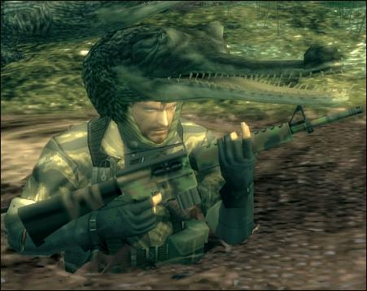

# Analysis of Metal Gear Solid 3: Snake Eater #
##### Even A. Nilsen    26.08.2016 #####

**High Concept:**   Tactical stealth action-adventure in third person. Every boys dream.

**Gameplay:**       Stay hidden and get through areas and challenges unnoticed.
                    Or go in guns blazing, up to you really.

**Genre:**          Tactical stealth action-adventure.

**Platform:**       Playstation 2 (console)

## Screenshots ##

Here you see the player sneaking up behind an enemy using the environment and
 his camouflage to his advantage.

One of the many "tactical" moves you can pull of in the game. Who would not like
 to hang from a tree while firing a gun?

A good example of how you can use the environment to hide. The player is using
 the fact that there are crocodiles in the swamp to his advantage.

## References ##
https://nigmabox.files.wordpress.com/2013/03/metal-gear-solid-3-hd-vita-image-2.jpg
http://ps2media.ign.com/ps2/image/MGS3snakeEater_051303_18med.jpg
http://img1.wikia.nocookie.net/\__cb20080207075116/metalgear/de/images/d/d4/Crocodile_cap.jpg
