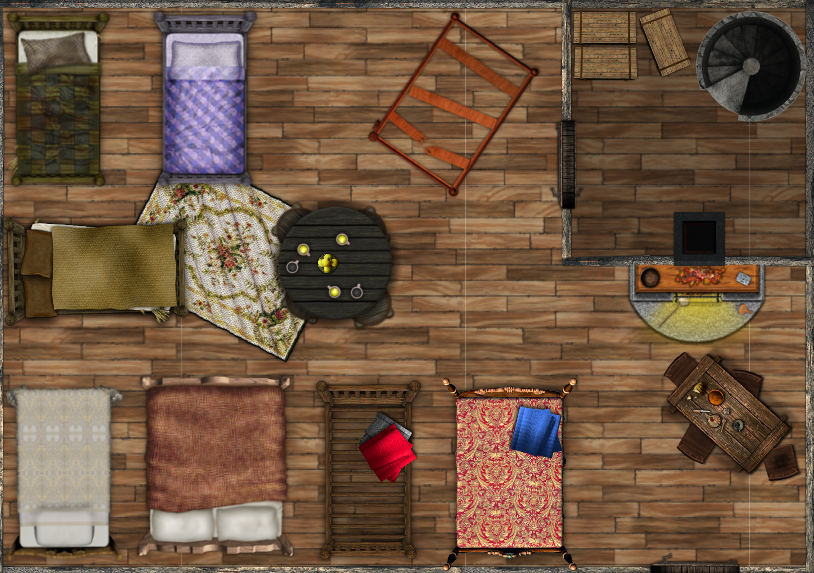
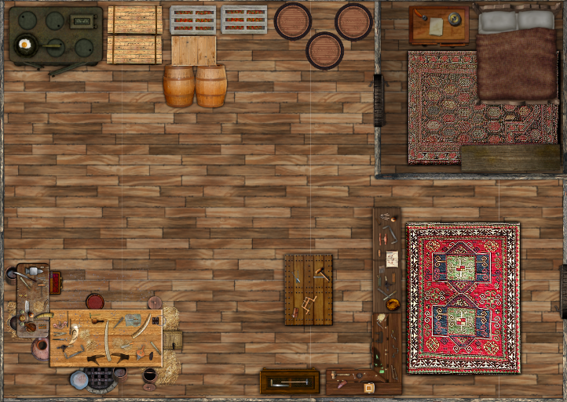

# Øde #
##### Even A. Nilsen    Assignment 3: GRDE2015 #####
##### *Lecturer:* Glen Spoors #####
#### Abstract ####
I have taken the liberty to change some of the facts about the game that was previously
 stated in the brief. The main story has been changed as well as the setting being
 more defined. In this document I will flesh out one of the settlements the player
 can come across and its inhabitants. The game asset being the settlement and its inhabitants.

### 1. Game Overview ###
Øde is a choice based interactive adventure roguelite with multiple possible outcomes.
 The player creates their own character with traits and skills they see fit to be
 able to survive the desolate wasteland that is the game world. It should be possible
 to go through the game in a multitude of different ways. Depending on the choices
 the player makes some paths will close and others will open.

### 2. Game World ###
The year is 2250 and humanity has failed to solve its most basic problem, namely
 the vast amounts of waste that has collected throughout the years. After the massive
 burning of waste it did not take long before pollution killed of most of both the
 fauna and flora. Many continents was rendered uninhabitable because of smokestacks
 pluming from the waste fires. Those with power and money were quick to evacuate
 the planet for new, promising colonies only reachable by spacecraft leaving Earth
 and those not rich enough behind. Society soon collapsed and anarchy took its hold
 on the remaining denizens of Earth.

In Øde, we zoom in on Norway where the story takes place. Norway is in a severe
 state of decay and there is little that nature has not claimed back. The protagonist
 sets out to explore the ruins of civilisation in hopes of somewhere to settle
 down.
\pagebreak

## Herberg Stene: The First Settlement ##
Herberg Stene was built by the patriarch known as Father Stene when he happened
 upon an abandoned power station after Norway was left to decay. He managed to get
 the station working and suddenly had a constant supply of electricity from which
 to build upon. Being a carpenter, he soon built the first building using the
 power station as a base. Due to the geography of Norway, a nearby, uncontaminated
 water source coming from the mountains was located. This water source not only
 gave Herberg Stene hydration, but the local fauna and flora was able to survive to.
 This has given the settlement sustenance and a solid ground for survival.

Throughout the years many travelers have come and almost as many has left without
 getting the opportunity to settle down in the safe haven. Father Stene's fear
 of getting used and his general antisocial behaviour has come to the settlement's
 benefit. He has made sure that only a select few deemed worthy by the Father himself
 has gotten the chance to settle down. *"If you can contribute, you can stay"* and
 *"We help our own"* has become a well known line amongst the people that has visited
 Herberg Stene. 

Multiple buildings and businesses has been built at Herberg Stene. The first building
 has been repurposed as a hostel for travelers and merchants.

\newpage

### Father Stene: The Patriarch ###
After living a life alone before society broke down, Father Stene has become a surly
 old man. Being the founder of the settlement, he has become somewhat of a dictator
 calling all the shots from his mansion. 

Using Freeman's *Diamond*(Freeman, 2003, p.64-69) I will try to give Father Stene depth as a character in
 the world.

1. **Fear** - Has strong tendencies of xenophobia. You have to be deemed worthy by no
 one but him.

2. **Hiding behind a stoic mask** - Father Stene comes of as a strong man devoid of
 emotion. It is hard to get a read on what he really feels.

3. **Secretive** - No one is allowed entrance into his mansion. Not even his closest
 men.

4. **Looks out for his own** - He might be a surly, stern and antisocial man, but
 when it comes to helping out his fellow man, he always does his best.

5. **Jealous** - Throughout the years he has taken many wives, unbeknownst to his
 citizens, this includes many of his daughters.

## First Meeting With Father Stene ##
*As you trek along the foot of the mountains, a small enclosed settlement comes
into view. The settlement seems to have been built with passion and skill, it
seems close to unbreechable. As you step up to the gate, you hear a voice calling
out.* 

    Man on the wall - "Who goes there? What is your business here? You better not
    be trouble."

    Protagonist
        1. Just passing through. Looking for a place to rest and maybe spend the night.
        2. (Carpenter) These are some strong looking walls, the person who built this
        obviously knows what they are doing.

*Generic answer*

    Man on the wall - "Well, this ain't no place for slackin' around and we don't
    take kindly to strangers around these parts."

    Protagonist
        1.

*Carpenter*

    Man on the wall - "Oh, really? So you think you know what you are talkin' about?"

\pagebreak

## References ##
Freeman, D. (2003). *Creating Emotions in Games: The Craft and Art of Emotioneering*
Indianapolis, Indiana: New Riders.
